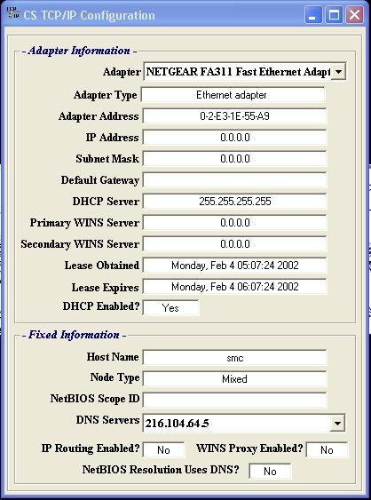



## CS TCP IP Configuration \- All API  \-UPDATED\-

### Description

I found the main API from some one elses source code, but it need alot of work. I tweaked it out and fixed some problems it had and also have it cleanup the resources it uses. I hope this helps anyone needing things like this.
 
### More Info
 

             |
---                |---
**Submitted On**   |2002-02-04 11:40:34
**By**             |[Shane Croft](https://github.com/Planet-Source-Code/PSCIndex/blob/master/ByAuthor/shane-croft.md)
**Level**          |Intermediate
**User Rating**    |4.9 (34 globes from 7 users)
**Compatibility**  |VB 6\.0
**Category**       |[Complete Applications](https://github.com/Planet-Source-Code/PSCIndex/blob/master/ByCategory/complete-applications__1-27.md)
**World**          |[Visual Basic](https://github.com/Planet-Source-Code/PSCIndex/blob/master/ByWorld/visual-basic.md)
**Archive File**   |[CS\_TCP\_IP\_52898242002\.zip](https://github.com/Planet-Source-Code/shane-croft-cs-tcp-ip-configuration-all-api-updated__1-31387/archive/master.zip)

